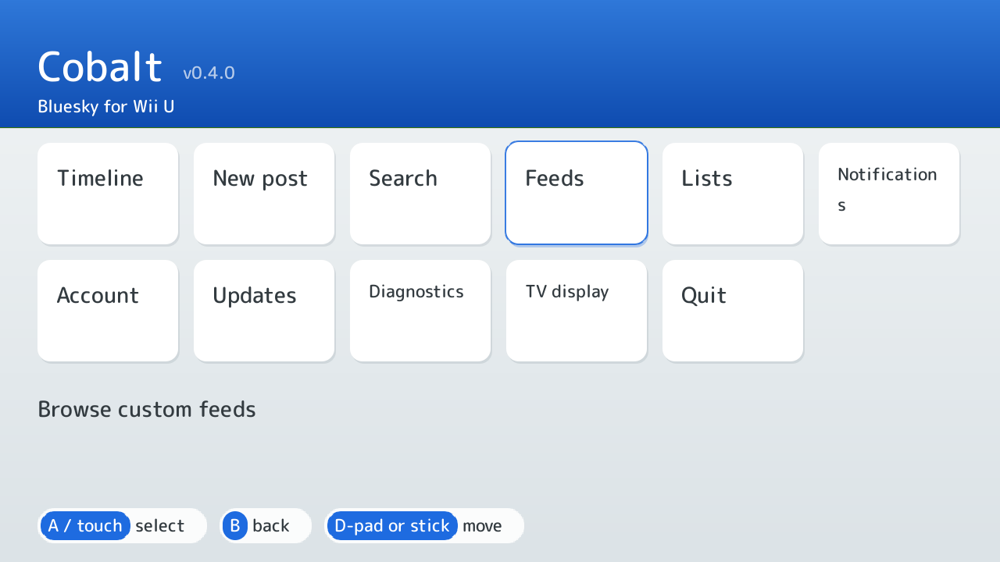
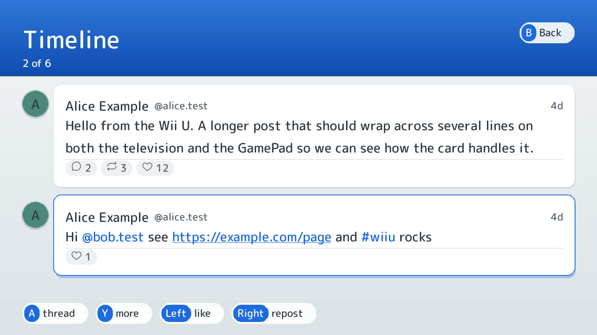
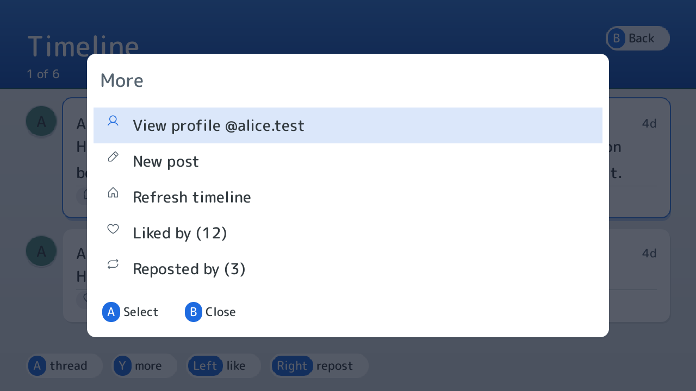
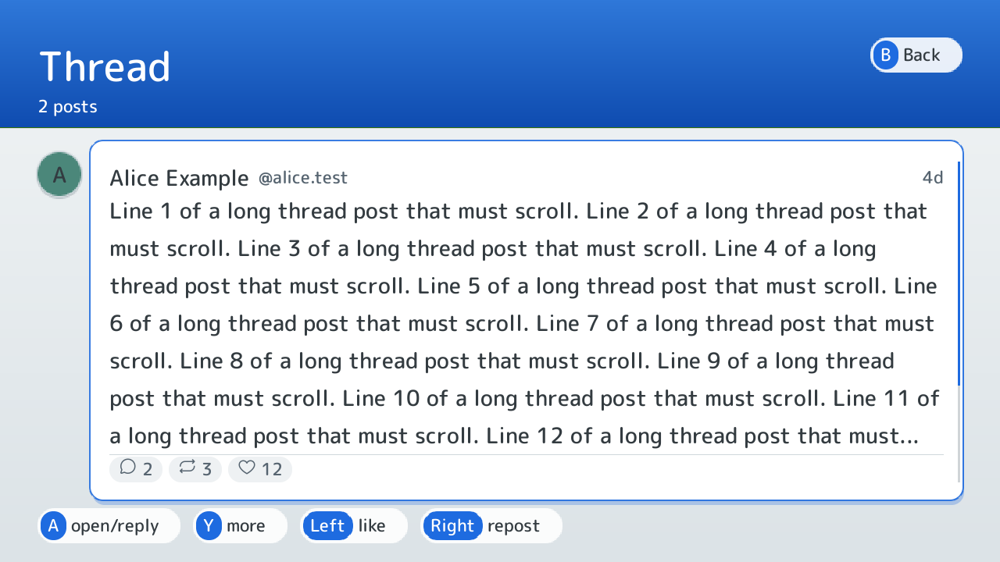
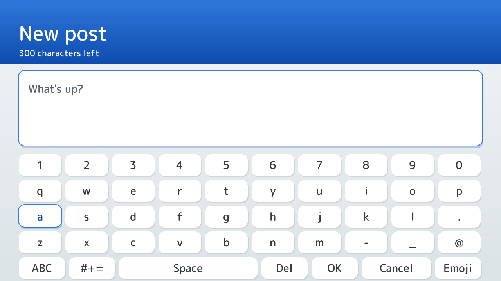
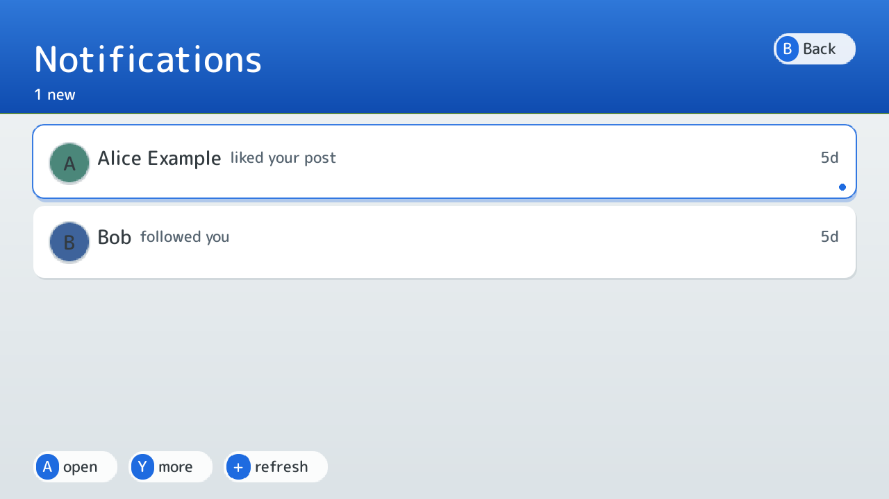
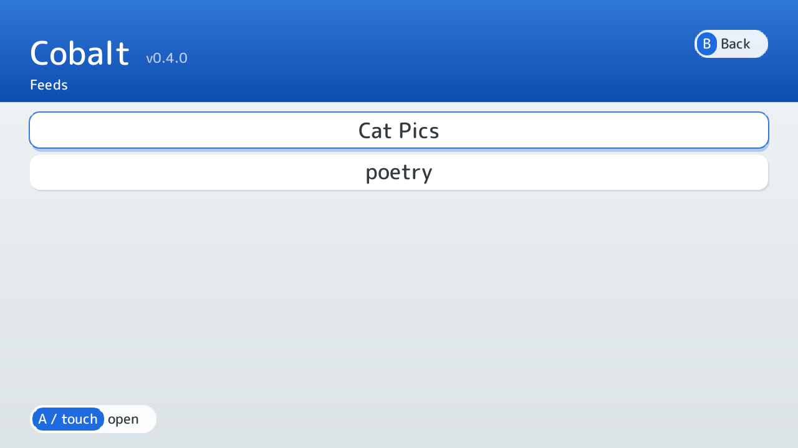

# Using Cobalt

This is what each screen does and which buttons do it, written from the code (`src/app/*.c`), not from memory. The screenshots are rendered on a PC by the host snapshot renderer from fixture data (an invented account), not captured on a Wii U, and they show the TV layout; the GamePad has its own layout of the same screen.

I have not walked through all of this on my console since I wrote it down, so if a button here does something else on yours, [open an issue](https://github.com/ewanc26/cobalt/issues).

## Buttons

| Button | Does |
|---|---|
| D-pad, either stick | Move. Up and Down go through lists; Left and Right are used for actions on a post (below). |
| A | Open or choose the highlighted thing. |
| B | Back. On the keyboard screens B types a backspace instead; leave with the keyboard's Cancel key. |
| X | A second action: new post on the timeline, quote on a thread, followers on a profile. |
| Y | The "More" menu for the highlighted post, notification or profile row. |
| + | Refresh, or on a profile, the next tab. |
| GamePad touch | Tap what you would press. Rows, the Back pill in the corner and the footer prompts are all tappable. Drag a finger up or down a list to scroll it; a drag never also counts as a tap. |

HOME never reaches Cobalt: Aroma keeps it. Leave with Quit on the home screen.

The footer names the buttons that work on the current screen. A prompt that names one button (for example "A: thread") is a button you can tap on the GamePad; one that names a range ("Up/Down: choose") is only a hint.

## Home

Timeline, New post, Search, Feeds, Lists, Notifications, Account (or Sign in), Updates, Diagnostics, TV display and Quit. Timeline, New post, Search, Feeds, Lists and Notifications need you signed in; the rest do not.

TV display switches between TV plus GamePad and Off-TV Play, where the TV goes idle and everything happens on the GamePad.

## Signing in

Account, then Sign in. There are two ways:

- **App password.** Fill in the server (`https://bsky.social` unless your account lives elsewhere), your handle and an [app password](https://bsky.app/settings/app-passwords), then choose Sign in. Not your account password.
- **OAuth, through a node.** Put the URL of a Wolfram OAuth node in the server field, your handle in the next, leave the app password empty. Cobalt shows a link and a code; open the link on a phone or computer, sign in there, and Cobalt carries on by itself.

The first time Cobalt runs without a seed file it asks you to scribble on the GamePad before anything else; see the README.

## Timeline

| Button | Does |
|---|---|
| Up, Down | Previous and next post. Reaching the bottom loads more. |
| A | Open the thread. |
| Left | Like (again to undo). |
| Right | Repost (again to undo). |
| X | New post. |
| Y | The More menu. |
| + | Refresh. |
| B | Back to home. |

The More menu lists, for the highlighted post: the author's profile, View image, every link, mention and hashtag in the text (a link only shows its address, since Cobalt cannot open a browser), New post, Refresh, Liked by and Reposted by.

## Thread

Shows the conversation around a post. Like and repost work as on the timeline. A on the post you opened is Reply; A on any other post opens the conversation from that post. X quotes, + replies, Y opens the More menu, which here also has Quote post and, on your own posts, Delete post (it asks first).

## Writing a post

You type on Cobalt's own keyboard: move with the D-pad or tap on the GamePad. Posting asks before it sends, and B from that screen goes back to editing rather than throwing the text away. A new post (not a reply) also lets you choose who can reply: everyone, people you follow and mention, or nobody. You can attach one picture from the SD card to a new post or quote and type its description.

## Notifications

Replies, mentions, quotes, likes, reposts and follows. A opens the post or the follower's profile. Y opens the More menu: the account's profile, the post, and refresh. + also refreshes.

## Profiles

A on a name or avatar opens a profile. On the header row: A follows or unfollows, Left mutes, Right blocks (none of these on your own profile). Y opens the More menu on any row. It lists followers, following and the next tab (posts, replies, media and, on your own profile, likes) and, on a post, the same entries as on the timeline. Posts work like the timeline.

## Search, feeds and lists

Search finds accounts and posts (switch with Y). Feeds lists the custom feeds your account has saved. Lists shows your curated lists and their members. In all of them A opens the thing and B goes back.

## Account

Muted accounts and Blocked accounts (A on one undoes it), the post language setting and Sign out, which wipes the saved session from the SD card.

## Updates

Updates asks GitHub whether there is a newer Cobalt. If there is, it shows the version and the notes and waits. A downloads it, the file is checked against its published checksum, and it replaces Cobalt when you quit; start it again from the Wii U Menu. The old copy is kept until the new one has started. It never updates by itself. The release's manifest is signed and Cobalt refuses one that is not; see the README.

## Diagnostics

Paths, network state, the trust store, the Wolfram SDK, the session, and how many avatars and thumbnails have loaded. It is the first place to look when something does not work.
